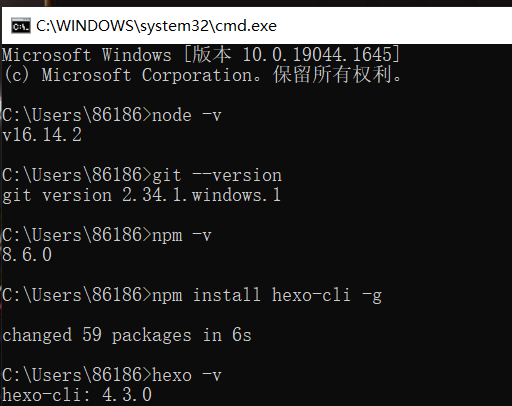
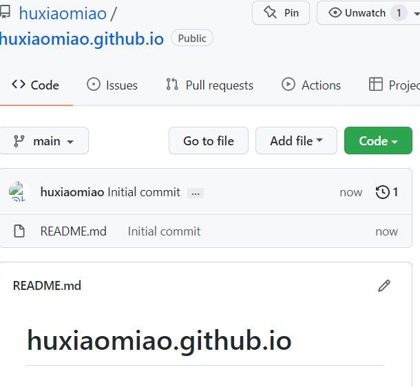
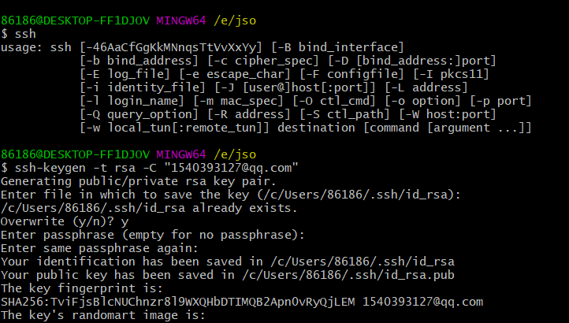
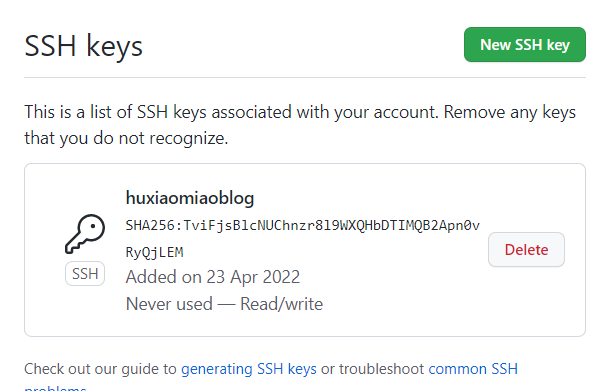
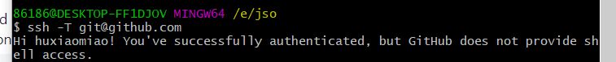
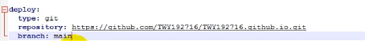
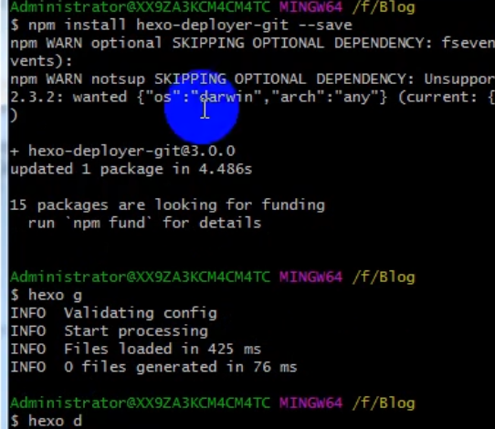
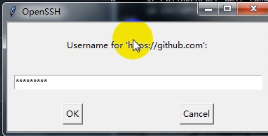
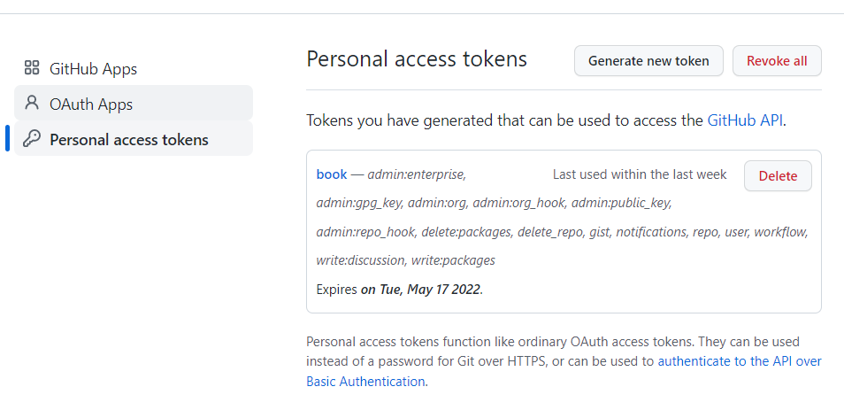
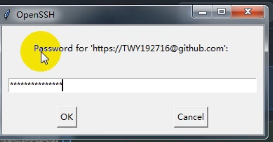

#hexo博客搭建
1. 

2. 搭建仓库
   

3. 生成SSH
   
   
   检查是否连接成功
   

4. 本地生成博客内容
   hexo init--初始化
   hexo s--静态生成本地页面

5. 发布博客到互联网
   .config.yml--
   更改：
   

   git bash：

   
   安装
   hexo-g--生成
   hexo-d --上传

   验证账户--将密码换成令牌token
   
   设置令牌
   developsettings
   
   
   成功后--通过网址访问