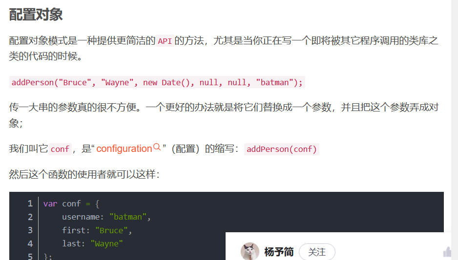
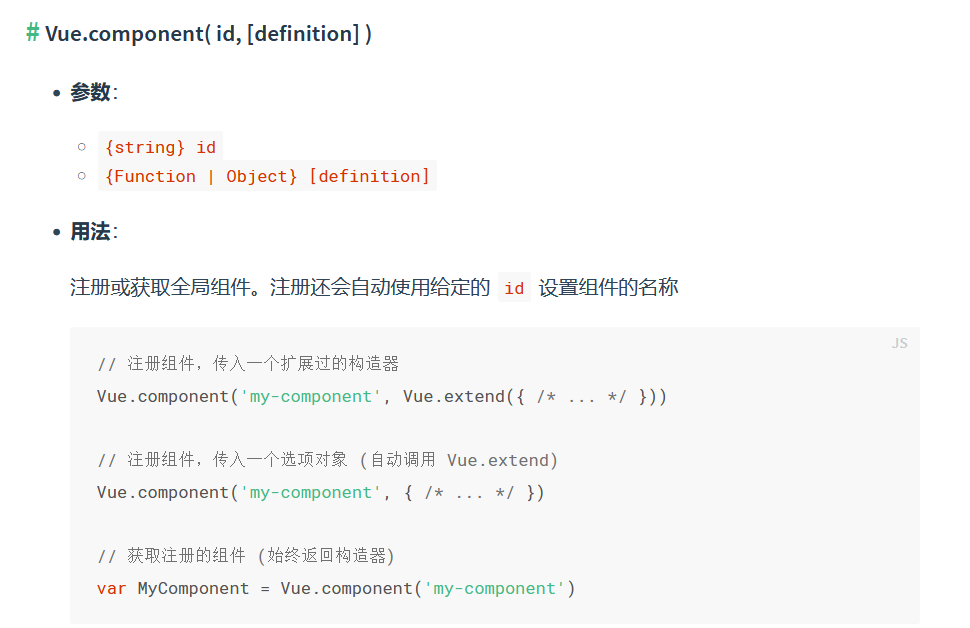
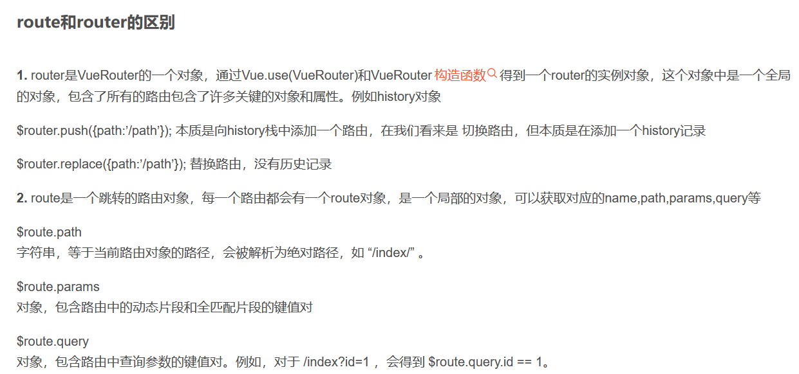

#4.25复习清单
##上午
1. vue基础内容--事件√
2. 风格指南√
3. vue面试题√
4. vue项目-创建项目/非路由组件/安装路由-安装3.1.1版本/路由组件/router配置路由/配置main.js/App.vue √
5. vue cli√--明天：自定义事件
   
##下午
1. 复习上午的内容√
2. vue项目-编程式导航-路由元信息-路由传参【对象】-相关面试题-props三种写法-处理错误-promise-call/apply √
3. js复习笔记√
4. js面试题√
5. 解决github上传问题
   
##晚上
1. 复习栈/队列算法√
2. 数据结构与算法×
3. 复习今天所有内容√
4. 做好明天的计划√

##问题
1. vue是什么？--构建用户界面的轻量级的js框架。
   构建用户界面：将数据在页面上体现。
   轻量级：自底向上了，简单应用只需要一个核心库，复杂的可以引入各种插件
2. UI是什么？--界面交互
3. 配置对象？
   
4. 模板语法分类--插值语法/指令语法
5. 数据绑定分类--单向/双向
6. el两种写法
7. data的两种写法--在组件中，必须使用函数/vue管理的，不能用箭头函数，why？--this指向不再是vue实例
8. MVVM模型：
   M：model--数据
   V：视图--模板
   VM：视图模型--vue实例
   data中的所有数据，最后都出现在vm身上
   vm身上的属性，原型上的属性【$】，在vue模板中都可以直接使用
9. 数据代理
10. 事件处理--事件修饰符--参数：$event--【prevent,stop,once】
    键盘事件
11. scoped:只在这个组件身上起作用--风格指南
12. ref属性--在vueComponent身上：获取DOM元素--通过this..$refs。xxx获取
13. 
14. 

