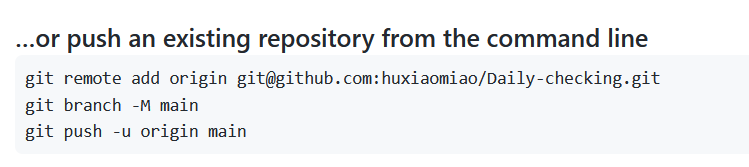

# Markdown基本语法

##二级标题
###三级标题

换了一行  
这是正文

这是第二段
**加粗ctrl+b**
*变斜体ctrl+i*

列表
1. 空格
2. 有序列表
    1. 二级列表

复制图片
ctrl + alt + v


插入公式

表格
| 表头 | 表头  | 表头 |
| ---- | :---: | ---- |
| 内容 | 内容  | 内容 |

alt+shift+f--格式化


插入链接
[链接](https://www.bilibili.com/video/BV1si4y1472o?spm_id_from=333.337.search-card.all.click)


添加代码块
```
var a = 1;
var b= 1;

```


==高亮==