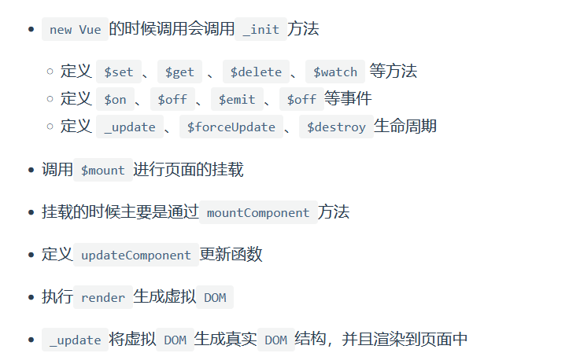

#vue面试题
##4.25
1. vue理解？
   是什么--核心特性【数据驱动】MVVM模型--组件化--指令系统【不用操作DOM】
   
   vue的所有界面事件，都只是操作数据；界面变动，都是数据绑定。
2. SPA理解
   单页面应用--动态更新页面，但不会重新加载--一个主页面和多个页面片段组成--局部刷新--速度快，用户体验好
   缺点：首次渲染速度慢
3. v-show/v-if:都是控制元素在页面是否显示
   v-if：false--DOM删除--切换过程中销毁和重建内部事件监听和子组件--【是真正的条件渲染】
   
   v-show：css-display：none--变成true不触发组件生命周期
   操作频繁--v-show
   不频繁--v-if
4. vue实例挂载的过程中发生了什么？
   new Vue()
   
   调用_init方法--定义方法。事件/生命周期--$mount进行页面挂载--render生成虚拟DOM--_update将虚拟的生成真实DOM结构，并渲染到页面中

5. vue生命周期理解
   创建--初始化数据--编译模板--挂载dom--render--update--render--卸载

   8个生命周期
   分别都干嘛呢

6. 数据请求在created和mounted的区别
   
created是在**组件实例一旦创建完成**的时候立刻调用，这时候页面**dom节点并未生成**
mounted是在页面**dom节点渲染完毕**之后就立刻执行的触发
时机上created是比mounted要更早的
**数据请求**-在mounted请求有可能导致**页面闪动**（页面dom结构已经生成）
但如果在**页面加载前完成**则不会出现此情况建议：放在create生命周期当中

7. v-if/v-for不建议一起使用
   **带来性能方面的浪费**（每次渲染都会**先循环再进行条件判断**）
   解决：
   
   条件出现在循环内部--计算属性：
   
   v-if:频繁的操作DOM，很耗性能
