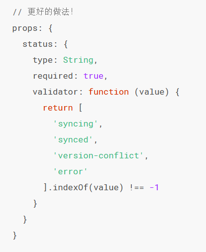
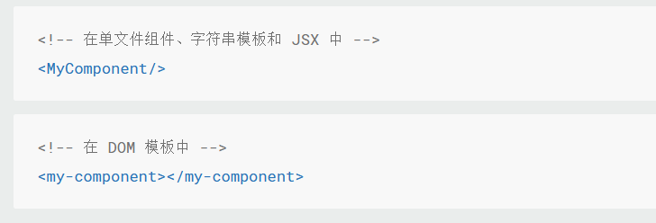
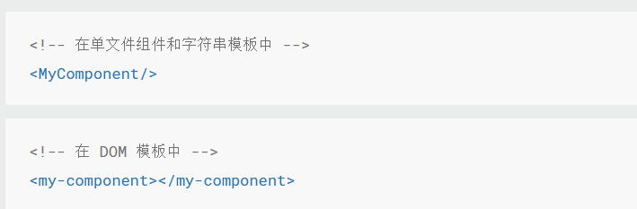

#风格指南
1. 组件名为多个单词
2. 组件数据--data必须是一个返回对象的函数
3. prop定义尽量详细
   
4. v-for设置键值--和虚拟DOM有关
5. 避免v-if和v-for用在一起
   缺点：渲染过度，降低性能。因为v-for优先级高
   解决: 先if再for
6. 为组件样式设置作用域--scoped
7. 子组件以父组件作为前缀
8. 自闭和组件
    
9. 组件大小写
    
    中间加一个-
10. 多个属性分行写
11. 复杂表达式用计算属性【也应该划分的简单】或方法。---v-if也可以用计算属性先筛选出需要的
12. 属性值要加引号
13. 指令用缩写